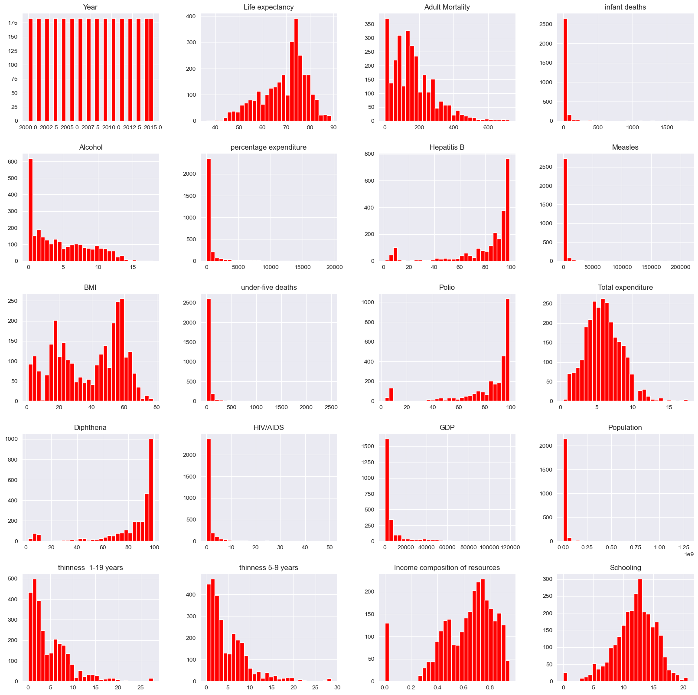
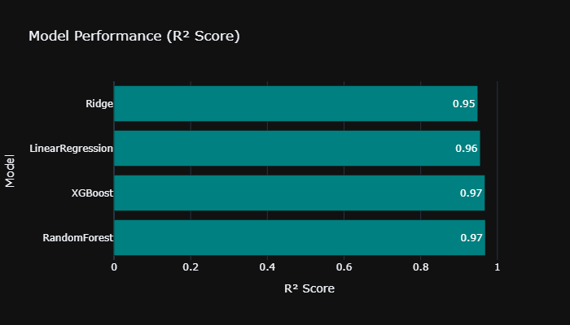
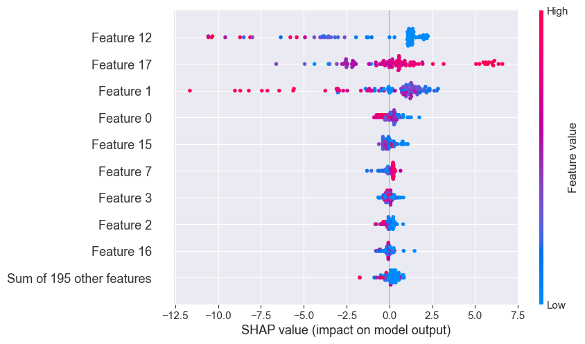

# Global Life Expectancy Estimator Predicting Longevity from Health and Economic Indicators


## 🌍 Overview
This project predicts **life expectancy** using global health, demographic, and economic indicators. It demonstrates advanced regression modeling, data preprocessing, model evaluation, and explainability.

## 📁 Dataset
- **File:** `Life_Expectancy_Data.csv`
- **Records:** 2,938
- **Features:** Health metrics, GDP, immunizations, alcohol use, schooling, population, etc.
- **Target:** `Life expectancy` (float)

### Data Distribution


## ⚙️ Features
- Missing Value Imputation
- Categorical Encoding (e.g., `Status`)
- Feature Scaling
- Model Comparison: Linear Regression, Ridge, Random Forest, XGBoost
- Visualizations with Plotly
- SHAP for feature importance

## 📊 Results
Best model: **Random Forest**

| Model           | MAE   | MSE   | R²    |
|----------------|-------|-------|-------|
| Random Forest  | ~1.0  | ~2.7  | ~0.968 |
| XGBoost        | ~1.0  | ~2.8  | ~0.967 |


### Model Performance Comparison


### Global Life Expectancy Map


> 📈 SHAP indicates that `Schooling`, `Income composition`, and `HIV/AIDS` rate are top predictors of life expectancy.

### SHAP Summary Plot


## 🧠 Tech Stack
- Python (Pandas, Scikit-learn, XGBoost, SHAP)
- Plotly (for interactive plots)
- Jupyter Notebook

## 🧪 How to Run
```bash
pip install -r requirements.txt
jupyter notebook
